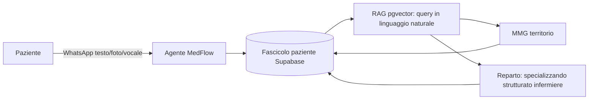

# MedFlow — Visione

> La memoria clinica intelligente che segue il paziente.

Questo documento riformula la missione di MedFlow alla luce di un periodo di
tirocinio in Gastroenterologia Universitaria (Cisanello, Pisa). Non descrive
il codice riga per riga: fissa **perche'** esistiamo, **per chi**, **cosa**
costruiamo e **cosa no**. La filosofia di fondo e' una sola: non aggiungere
l'ennesimo gestionale, ma immedesimarsi nel punto preciso in cui
l'informazione clinica si perde, e metterla li' dove serve, al momento giusto.

---

## 1. Il problema vissuto

In reparto l'informazione clinica e' **frammentata, dimenticata e costosa**.

- E' frammentata: faldoni cartacei, CD radiologici (nel 2026), fax spesso
  ignorati, invii via email/telefono/WhatsApp, e copia-incolla manuale tra
  sistemi che non si parlano (Pleiade, Zimbra, Suite Estensa, referti). Non
  esiste un fascicolo paziente unico ed ereditabile: ogni medico riparte da
  quello che riesce a raccogliere a voce.
- E' dimenticata: allergie dichiarate in Pronto Soccorso e mai annotate,
  terapie domiciliari fotografate su foglietti, procedure gia' fatte di cui si
  perde traccia. Ogni dimenticanza puo' valere giornate di ricovero in piu' —
  un costo sanitario ed economico per il paziente e per il sistema.
- E' costosa da recuperare: 300 click e password per leggere il valore di un
  esame, tre medici che perdono ore a decidere dove guardare e raccolgono
  comunque un'anamnesi parziale.

Il filo conduttore: **i dati esistono ma non sono dove servono, quando
servono, a chi serve.** Questo e' esattamente il vuoto che MedFlow riempie.

---

## 2. La riformulazione: dal copilot-del-medico al fascicolo-del-paziente

Oggi MedFlow e' descritto come "il copilot del medico" ([README.md](README.md)).
La visione lo ribalta di prospettiva:

> **MedFlow e' la memoria clinica del paziente.** Un fascicolo che appartiene
> al paziente e lo segue, non al singolo medico o al singolo reparto.

Lo stesso record strutturato (Supabase) e lo stesso agente conversazionale
(WhatsApp) alimentano viste diverse: il Medico di Medicina Generale sul
territorio e il reparto in degenza leggono e arricchiscono **lo stesso**
fascicolo. L'informazione diventa per costruzione consistente attraverso ogni
contatto sanitario del soggetto, invece di essere ricostruita da capo ogni
volta.

---

## 3. Gli attori e le viste

Un unico nucleo dati (`pazienti`, `conversazioni`, `anamnesi_documenti`),
permessi e viste differenti:

- **Paziente** — possiede il fascicolo. Interagisce via WhatsApp (testo, foto,
  vocale), riceve reminder, fornisce documenti e anamnesi.
- **MMG / territorio** — vede la storia longitudinale del paziente, prepara la
  visita, interroga il fascicolo.
- **Reparto / degenza** — specializzando, strutturato, infermiere, primario.
  Hanno bisogno di una sintesi consultabile al letto del paziente e di poter
  inserirsi nella conversazione (i messaggi del medico fanno parte dello stesso
  contesto che l'agente vede al turno successivo).

Lo stesso fascicolo, viste e permessi diversi: il paziente non vede le note
private cliniche, lo specializzando non deve maneggiare password che non gli
competono, il primario ha una sintesi del caso.

---

## 4. Le capacita' core

Molte non sono da inventare: sono gia' parzialmente costruite nei PR #1-#4 e
vanno ricomposte attorno al paziente.

- **Memoria clinica persistente patient-centric** — antidoto a dimenticanze,
  allergie perse, procedure ripetute. Stato in `pazienti.session_state` /
  `session_data`, storia in `conversazioni`.
- **Ingestione multimodale** — foto di liste farmaci, referti via OCR, vocali,
  e in prospettiva i contenuti dei "CD del 2026". Nodi `vision_ocr` e `whisper`
  in [agent.py](agent.py).
- **Query in linguaggio naturale sul fascicolo** — la fine dei "300 click":
  fai una domanda, ottieni il pezzo di documento pertinente. RAG su pgvector,
  RPC `match_anamnesi_documenti` ([web-app/sql/add_pgvector_and_anamnesi_documenti.sql](web-app/sql/add_pgvector_and_anamnesi_documenti.sql)).
- **Anamnesi conversazionale stateful** — raccolta guidata e completa invece
  che parziale. Nodo `anamnesis_copilot`.
- **Centralizzazione documentale anti-frammentazione** — un solo posto, non
  fax/CD/email sparsi. Bucket `referti` e `vocali`.
- **Reminder terapia per il paziente** — pillole, orari, follow-up.
- **Traduzione per pazienti internazionali** — l'agente conversa nella lingua
  del paziente, il fascicolo resta in italiano per il medico.
- **Decision support prescrittivo** — confronto di dose/timing/farmaco con
  linee guida e good practice (capacita' adiacente, vedi sezione 5).

---

## 5. Mappa attrito -> capacita' -> fattibilita'

Ogni attrito annotato in tirocinio, classificato in tre fasce. Questa e' la
disciplina di prodotto: dire chiaramente cosa risolviamo, cosa tocchiamo solo
con integrazioni, e cosa lasciamo fuori.

### Core MedFlow (lo risolviamo con l'architettura attuale)

- Persone che dimenticano informazioni/procedure gia' fatte -> memoria
  clinica persistente.
- Allergie/inadeguatezze dichiarate in PS e poi dimenticate dal reparto ->
  memoria patient-centric con alert in sintesi.
- Pazienti che dimenticano terapia (pillole, orari) -> reminder terapia.
- Farmaci segnati su foglietti fotografati su WhatsApp -> ingestione
  multimodale che struttura la lista farmaci nel fascicolo.
- 300 click e password per leggere un valore d'esame -> query in linguaggio
  naturale che "sputa" il pezzo di documento richiesto.
- Anamnesi lenta, parziale, tre medici per ore -> anamnesi conversazionale
  stateful + RAG sulla storia pregressa.
- Ricerca di file nei faldoni / informazioni segmentate / niente fascicolo
  nazionale ereditabile -> fascicolo paziente unificato e patient-centric.
- Invio file scattered (email/fax/telefono/CD) e gestione file pessima ->
  centralizzazione documentale in un unico bucket consultabile.
- Pazienti che perdono la propria storia clinica / arrivano senza documenti ->
  il fascicolo vive sul paziente e si arricchisce a ogni contatto.
- Comunicazione medico-paziente lenta mediata dalle infermiere -> canale
  conversazionale diretto e asincrono.
- Comunicazione difficile con pazienti internazionali -> traduzione.
- Ricovero del singolo paziente painful (raccolta documenti incompleta) ->
  pre-compilazione del fascicolo prima/durante l'ammissione.

### Adiacente / integrazione (fattibile, ma richiede regole cliniche o
### connettori a sistemi terzi)

- Prescrizioni errate per abitudine (dose/timing/tipo farmaco) -> decision
  support prescrittivo vs linee guida (serve una base di regole/linee guida
  validate clinicamente).
- Consulenze inutili a specialisti -> triage/pre-screening sul fascicolo prima
  di escalare.
- Catena di comando medico-infermiere-paziente con ordini invertiti ->
  handoff strutturato e tracciato dei task.
- Consensi informati e tutori legali su carta -> consenso digitale nel flusso
  conversazionale.
- Autocompletamento/trascrizione ripetitiva in cartella clinica / STU /
  Pleiade -> generazione assistita di testo (richiede integrazione con
  Pleiade).
- Copia-incolla tra Pleiade/Zimbra/Suite Estensa/referti -> il fascicolo come
  sorgente unica riduce il problema, ma l'eliminazione totale richiede
  connettori ai sistemi.
- Visite che sono solo consulti -> aggancio a videochiamata.
- Comunicazione difficile specializzando-strutturato su decisioni urgenti ->
  canale strutturato di escalation (in parte prodotto, in parte cultura).
- Spreco su sacche e integratori -> tracciamento nel fascicolo per evidenziare
  ridondanze (richiede dati di magazzino/prescrizione).

### Fuori scope (non e' MedFlow: e' infrastruttura IT, hardware o organizzazione)

- PC vecchi/lenti che si scaricano durante la ronda.
- Latenza dei sistemi e perdita di dati gia' appuntati.
- Pleiade down / mancanza di ridondanza informatica e di assistenza tecnica.
- Password sui foglietti attaccati al case, profili condivisi, profili Gmail
  collegati ai PC (problema di sicurezza/governance IT).
- Telefoni vecchi, numeri su foglietti volanti, fax ignorati.
- Code lunghissime per gastroscopia/colonscopia e prenotazione esami
  (problema di capacita'/scheduling ospedaliero).
- Mancanza di spazi tranquilli per ragionare; comportamenti passivi e
  patata-bollente (problema organizzativo/culturale).
- Non sapere fisicamente dove andare/chi contattare (wayfinding).

> Nota: anche se l'infrastruttura IT e' fuori scope, MedFlow offre per natura
> una **ridondanza leggera dell'informazione**: quando i sistemi di reparto
> vanno down, una copia consultabile della sintesi paziente resta raggiungibile
> via WhatsApp/dashboard.

---

## 6. Cosa MedFlow NON e'

- **Non sostituisce Pleiade** ne' la cartella clinica ufficiale. E' un layer
  leggero che ci si appoggia sopra.
- **Non risolve l'hardware, la rete o la sicurezza IT dell'ospedale.** Non
  gestiamo PC, password di sistema, ridondanza di rete.
- **Non e' un altro gestionale da riempire.** Se aggiunge click invece di
  toglierli, ha fallito.
- **Non e' un dispositivo medico che decide al posto del clinico.** Suggerisce,
  ricorda, struttura; la decisione resta del medico.

---

## 7. Roadmap riformulata

I PR gia' completati sono i mattoni di questa visione, non lavoro a perdere:

- **PR #1 (DONE)** — schema dati, log conversazionale, idempotenza webhook:
  le fondamenta del fascicolo.
- **PR #2 (DONE)** — job queue Postgres + worker: l'agente regge il carico
  reale in modo disaccoppiato.
- **PR #3 (DONE)** — agente LangGraph (anamnesi, OCR, Whisper, sintesi
  clinica): l'ingestione multimodale e l'anamnesi conversazionale.
- **PR #4 (DONE)** — pgvector + RAG (`match_anamnesi_documenti`): la query in
  linguaggio naturale sul fascicolo.

Prossimi passi candidati (senza impegno su date, da prioritizzare):

1. **Fascicolo paziente unificato consultabile** — vista che ricompone storia,
   documenti, terapie e sintesi in un'unica schermata.
2. **Viste e permessi multi-attore** — paziente / MMG / reparto sullo stesso
   record.
3. **Reminder terapia** — pillole e orari verso il paziente.
4. **Traduzione** per pazienti internazionali.
5. **Decision support prescrittivo** vs linee guida (con base di regole
   validata).

---

## 8. Principi guida

1. **Patient-centric.** Il fascicolo appartiene al paziente e lo segue.
2. **Riduzione del carico cognitivo.** Ogni feature deve togliere click,
   attese e fatica al medico, non aggiungerne.
3. **Immedesimazione nel problema.** Progettiamo partendo dal punto in cui
   l'informazione si perde nel mondo reale, non dalla tecnologia.
4. **Il dato giusto, al momento giusto, alla persona giusta.**
5. **Niente gestionale in piu'.** Ci appoggiamo ai sistemi esistenti, non li
   duplichiamo.
